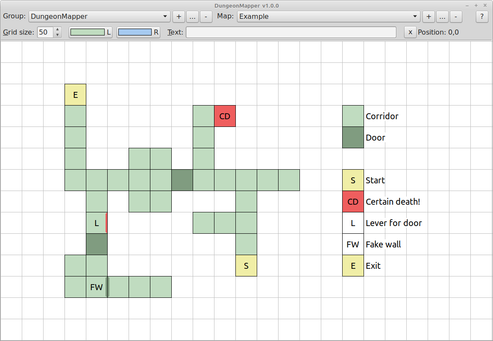

# About

DungeonMapper is a simple tool to draw maps for old-school dungeon crawler games such as *Dungeon
Master*, *The Bard's Tale* and *Eye of the Beholder*.

# Usage

## Basic editing

Many functions involve holding down one or more modifier keys (*Shift*, *Ctrl* and *Alt*) and
clicking mouse buttons. Most of these functions work on the following ideas:

- No modifiers - set colours on a tile.
- *Ctrl* - clear something on a tile.
- *Shift* - set something *from* a tile.
- *Alt* - do something with text.

The exception to this is when all three modifiers are held down to open the colour picker.

### Colouring and clearing tiles

The two buttons on the toolbar marked *L* and *R* control the colours used when colouring tiles.
Click either of these to select a new colour from the colour picker. Alternatively, hold down
*Shift*, *Ctrl* and *Alt* and click anywhere on the map with either the left or right mouse button
to open the colour picker for that button.

Click the left or right mouse buttons in a tile to set its colour to the *L* or *R* colour. Click
near the centre of a tile to set the main tile colour or click near one of a tile's edges to set the
colour of just that edge.

Hold down *Ctrl* and click the left or right mouse button near the centre of the tile to clear it,
including its edge colours and text. Click near one of the edges to clear just that edge.

Hold down *Shift* and click the left or right mouse button to set the corresponding colour in the
toolbar from the tile. The colour can be set from the centre or the edges of the tile.

### Undoing and redoing

Press *Alt+Z* to undo the last change and *Shift+Alt+Z* to redo the last undo.

### Zooming and panning

Zoom the map in and out with the mouse wheel and pan the map by dragging with the right mouse button
held down. If you lose track of the map while panning, press the *X* button on the toolbar to
re-centre it.

## Setting and clearing text

Hold down *Alt* and click the left mouse button on a tile to add the text in the *"Text"* input box
on the toolbar to that tile. The text will be centered in the tile.

Hold down *Alt* and click the right mouse button on a tile to add the text to the tile left-aligned
with no background colour or border line.

Hold down *Shift* and *Alt* and click either mouse button to set the text in the *"Text"* input box
from the tile.

Hold down *Ctrl* and *Alt* and click either mouse button to clear a tile's text.

## Advanced editing

### Selecting tiles

Hold down the left mouse button and drag to select multiple tiles. Press *Esc* or select some empty
tiles to clear the selecion.

### Cutting, copying and pasting

Press *Alt+C* to copy the selected tiles or *Alt+X* to copy and cut the selected tiles. Press
*Shift+Alt+X* to cut the tiles without copying them.

Press *Alt+V* to paste the copied tiles at the current mouse position.

*Note:* Using *CTRL+C*, etc. will operate on the *"Text"* input box on the toolbar.

### Shifing selected tiles

Hold *Alt* and use the cursor keys to shift the selected tiles up, down, left or right.

# Building

DungeonMapper is built using Lazarus, a cross-platform IDE, freely available from the [Lazarus
homepage](https://www.lazarus-ide.org/).

However, note that this sotware is developed on GNU/Linux and has not been tested on any other
platform.

# License

Copyright (C) 2023 Chiizujin.

DungeonMapper is free software: you can redistribute it and/or modify it under the terms of the GNU
General Public License as published by the Free Software Foundation, either version 3 of the
License, or (at your option) any later version.

DungeonMapper is distributed in the hope that it will be useful, but WITHOUT ANY WARRANTY; without
even the implied warranty of MERCHANTABILITY or FITNESS FOR A PARTICULAR PURPOSE. See the GNU
General Public License for more details.

The image files in the *res/* directory and *dungeonmapper.ico* in the *src/* directory are also
released under the terms of the GNU General Public License.

See the *LICENSE* file for the text of the GNU General Public License.
